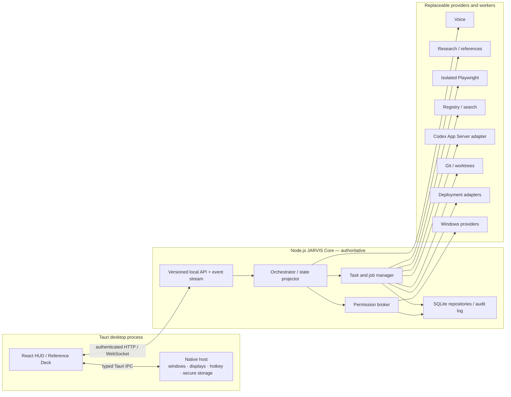

# JARVIS Architecture

Status: Implemented through Phase 4
Last updated: 2026-08-17

## Purpose

JARVIS is a Windows-first local desktop operating layer. It combines a realtime conversation surface with asynchronous research, references, project retrieval, coding agents, Git, deployment, memory, and allow-listed system control. The architecture keeps platform APIs, model providers, and agent transports replaceable so a later macOS port does not require rewriting the core.

Phases 0–4 implement the monorepo foundation, typed event stream, functional HUD, multi-monitor Reference Deck, global activation, and provider-based realtime voice. Later subsystem sections remain the target architecture until their named phase is complete.

## Phase 0 implementation

- Workspace packages: protocol/provider contracts, config, database, logging, event-bus foundation, permission types, OS abstractions, and shared UI tokens.
- Core process: Node.js/TypeScript HTTP and WebSocket server on `127.0.0.1:43117`.
- Desktop shell: React 19/Vite frontend plus a minimal Tauri 2 Rust host.
- Runtime state: `%LOCALAPPDATA%\Jarvis-development` in development, `%LOCALAPPDATA%\Jarvis-test` in tests, and `%LOCALAPPDATA%\Jarvis` in production. `JARVIS_DATA_DIR` provides an explicit isolated override.
- SQLite: foreign keys, WAL mode, versioned migrations, and initial tables for every required domain. Secret values are excluded by design.
- Development launcher: a random 256-bit launch token is passed to the core and dashboard processes through their environment; it never appears in the URL.
- Build outputs: `apps/dashboard/dist` and `services/core/dist`.

## Phase 2 HUD projection

The React dashboard reduces registered events into a local display projection. `jarvis.state.changed` drives the orb and mode label; telemetry values originate in `system.telemetry`; project, agent, conversation, and approval surfaces remain empty until corresponding typed events exist. Connection health is transport state rather than decorative UI state.

CPU and memory use Node OS counters, disk uses filesystem statistics, and network status uses active non-loopback interfaces. Microphone/voice telemetry follows validated voice lifecycle events and reports the provider unavailable when its server credential is absent. The normal conversation surface contains user-facing activity only; raw event metadata is isolated in an explicit developer inspector. Animation respects `prefers-reduced-motion`.

## Phase 3 display topology and Reference Deck

`DisplayProvider` isolates monitor/window operations. The Tauri implementation uses native monitor work areas, physical-to-logical DPI conversion, and a separately labeled `reference-deck` WebView window. The browser implementation exposes one primary display and opens the deck as a popup for web-only development.

HUD and reference monitor IDs persist under `jarvis.display-placement.v1`. The default chooses the primary display for the HUD and the first distinct display for references. A three-second topology poll reconciles missing monitor IDs, moves an existing deck back into a valid work area, and falls back to the same display without crashing. On one display the deck opens as an offset, resizable 75%×80% window.

The deck implements `SOURCES`, `IMAGES`, `VIDEO`, `WEB`, `CODE_DIFF`, `DOCUMENT`, and `EMPTY` modes. `reference.display.requested` is the sole display-content event contract; visual selection remains Phase 7.

## Phase 4 activation and voice

`HotkeyProvider` owns registration and cleanup of `Alt+Space`. The native adapter uses the Tauri global-shortcut plugin with only register/query/unregister permissions; the browser development adapter listens for the same chord only while the page is focused. Activation restores, shows, and focuses the HUD before starting voice. Registration conflicts are visible and never replace another application's shortcut.

`OpenAiWebRtcVoiceProvider` keeps microphone capture, remote audio playback, mute, input/output device selection, and the WebRTC peer in WebView2. `services/voice` owns provider call creation. The dashboard posts an SDP offer to authenticated JARVIS Core; Core creates `POST /v1/realtime/calls` with the server-side `OPENAI_API_KEY` and returns only the SDP answer and non-secret call ID. No standard or temporary provider credential crosses into renderer state.

Server VAD creates responses and enables response interruption. Data-channel events map to typed `voice.*` events and durable transcript messages; the HUD never infers listening/speaking state from transcript text. Unexpected peer loss has a bounded two-attempt reconnect. Explicit **END VOICE** stops tracks and the peer, so V1 has no always-listening cloud microphone.

## Phase 5 orchestrator and tool routing

`IntentRouter` accepts only a validated user-origin request with optional active project/task context. It scores route-specific language features, context evidence, and a conversation baseline, returning a ranked route decision with confidence, clarification flag, reasons, and a bounded 3–8 tool shortlist. Explicit action routes receive context-sensitive precedence over project-knowledge matches. The shortlist always contains `tool.search` as a safe discovery escape hatch, avoiding injection of the entire future tool catalogue.

The authenticated `POST /commands/route` boundary records the user message and publishes `conversation.route.selected`; completed user voice transcripts enter the same router. Routing is selection only: decisions contain no arguments, approval, receipt, or executor capability. Phase 5 deliberately does not execute the selected research/project/coding/browser/system route. The HUD text composer and current-route readout are projections of these real decisions.

## Architectural principles

1. The Node/TypeScript core owns business rules and authoritative state.
2. React renders projections of typed state; it does not infer behavior from assistant prose.
3. Tauri/Rust is a narrow native host for windows, displays, global hotkeys, packaging, and native capabilities.
4. Every cross-boundary message is versioned and runtime-validated.
5. Long-running operations are durable asynchronous jobs; voice remains responsive.
6. Tool selection is not permission. The permission broker mediates every action at execution time.
7. Consequential operations require action-bound authorization, not a broad conversational implication.
8. Web content is untrusted data and retains provenance through the pipeline.
9. Coding tasks use isolated worktrees and one writer per task.
10. Windows-specific behavior sits behind provider interfaces.
11. Secrets are references resolved at the last responsible moment; they are not ordinary config/database fields.
12. Development, test, and production state are physically separated.

## Process and ownership model



### Tauri desktop

The dashboard and Reference Deck may be separate native windows backed by the same frontend package. Tauri owns:

- window creation, focus, placement, and display discovery;
- the `Alt+Space` global shortcut;
- optional startup registration and native notifications;
- secure-store integration when a Rust/native implementation is required;
- packaging, update, and crash lifecycle hooks;
- typed IPC for native operations that cannot safely or portably live in Node.

Tauri does not own conversation routing, permissions, task state, project metadata, agent state, deployment rules, or memory policy.

### JARVIS Core

The local Node service owns:

- orchestrator and tool router;
- typed event bus and state projections;
- task/job state machines and cancellation;
- centralized permissions and approval records;
- configuration, project registry, memory, and repositories;
- research/reference evaluation;
- coding-agent, Git/worktree, and deployment workflows;
- structured logs, health, and notifications.

The service binds to `127.0.0.1` by default. Phase 0 will make the port typed/configurable; the provisional development default is `43117`. Expected endpoints are:

- `GET /health` — process, protocol, schema, and dependency health;
- `GET /capabilities` — supported protocol/providers/native capabilities;
- `WS /events` — authenticated validated event stream (replay is added in Phase 1);
- `POST /voice/call` — authenticated bounded SDP call creation;
- `POST /voice/events` — authenticated strict voice lifecycle/transcript input;
- `POST /commands/route` — authenticated strict user intent classification;
- `/v1/commands/*` — future typed, narrowly scoped dashboard commands.

LAN binding is disabled by default and is not part of Phase 0.

The protocol version is `1.0.0` and the event schema version is `1`. Health and capability payloads are runtime-validated by the dashboard. Phase 1 adds an authenticated handshake message, replay cursor, bounds, and backpressure.

### Workers and providers

Long-running or failure-prone integrations run behind providers. Providers may be in-process modules or supervised child processes; callers do not rely on that detail. A provider must declare capabilities, health, cancellation behavior, timeout defaults, and emitted event types.

## Local transport

The dashboard/core transport has:

- protocol version and schema version in the handshake;
- a launch-scoped random bearer token communicated through an ACL-restricted local handoff, never in a URL;
- strict loopback binding and allowed-origin validation;
- typed command IDs, correlation IDs, replies, errors, and idempotency keys;
- heartbeat, reconnect with backoff, last-seen sequence, and bounded replay;
- payload limits and backpressure;
- explicit incompatible-version failure rather than best-effort parsing.

Tauri IPC uses a separate typed command surface for native-host operations. Browser-rendered external content never receives that IPC capability.

## Protocol model

The shared protocol package will define runtime schemas and inferred TypeScript types. JSON is the baseline transport encoding; the domain model is independent of transport.

```ts
interface JarvisEvent<TPayload = unknown> {
  id: string;
  sequence: number;
  timestamp: string;
  sessionId?: string;
  correlationId?: string;
  causationId?: string;
  taskId?: string;
  projectId?: string;
  type: string;
  source: string;
  schemaVersion: number;
  payload: TPayload;
}
```

Additional envelope families:

- `JarvisCommand<T>` — intent from an authenticated client to the core;
- `CommandAccepted` — durable operation/job identity;
- `CommandResult<T>` — immediate successful result;
- `JarvisError` — stable code, safe message, retryability, correlation, and private diagnostic reference;
- `ApprovalRequest` / `ApprovalDecision` — action-bound authorization exchange;
- `HealthSnapshot` and `CapabilityManifest`.

Malformed inbound messages are rejected and counted. Malformed provider messages are quarantined as diagnostics and do not mutate domain state.

## Event bus and state projection

Phase 1 implements the validated registry, monotonic sequence high-water mark, durable SQLite history, bounded cursor replay, duplicate window, authenticated subscription handshake, slow-consumer cutoff, and dashboard reconnect. See `docs/events.md` for the wire contract.

Event families are namespaced as required: `jarvis.*`, `voice.*`, `conversation.*`, `agent.*`, `research.*`, `reference.*`, `browser.*`, `project.*`, `codex.*`, `git.*`, `deployment.*`, `system.*`, `approval.*`, `memory.*`, and `notification.*`.

The bus has two layers:

1. **Transient delivery** for low-value deltas such as waveform samples or high-frequency token chunks.
2. **Durable events** for lifecycle transitions, tool activity summaries, approvals, important errors, diffs, pushes, deployments, memories, and notifications.

Reducers/projectors derive HUD state from events. A state transition must not depend on text in a conversation message. Sequence numbers and idempotent reducers allow reconnect/replay without duplicating effects.

## Asynchronous interaction model

A conversation turn may create zero or more jobs. The conversational lane can immediately acknowledge a job and remain available.

Example research flow:

1. Orchestrator accepts a turn and emits `research.started` with a correlation ID.
2. Voice starts a concise acknowledgement or partial answer.
3. Research provider emits structured source events and completes a `ResearchResult`.
4. Reference evaluator runs independently and emits `reference.evaluating`.
5. If above policy threshold, media retrieval continues and the Reference Deck receives `reference.display_requested`.
6. The answer, sources, and references converge under the same correlation ID without blocking voice.

Coding, indexing, verification, Git, and deployment use the same job pattern and explicit state machines.

## Orchestrator and tool routing

The orchestrator resolves conversation context and selects a domain route: conversation, research, project, coding, browser, Git, deployment, system, reference, or memory.

Routing uses:

1. deterministic constraints and active context (for example, an explicit task ID);
2. a compact catalogue of tool categories and capabilities;
3. a classifier/router that returns route, confidence, and a bounded shortlist;
4. an always-available safe discovery operation that can expand the shortlist;
5. target resolution and ambiguity checks;
6. permission evaluation at execution, independent of route selection.

The router may propose actions. It cannot grant permission.

## Provider interfaces

Provider contracts are defined early in shared/core packages and implemented in service-specific packages. At minimum:

```ts
interface LlmProvider {}
interface VoiceProvider {
  health(): Promise<ProviderHealth>;
  state(): VoiceRuntimeState;
  activate(): Promise<void>;
  setMuted(muted: boolean): Promise<void>;
  listDevices(): Promise<VoiceAudioDevice[]>;
  setInputDevice(deviceId?: string): Promise<void>;
  setOutputDevice(deviceId?: string): Promise<void>;
  subscribe(listener: VoiceStateListener): () => void;
  disconnect(): Promise<void>;
}
interface ResearchProvider {}
interface ImageSearchProvider {}
interface VideoSearchProvider {}
interface BrowserProvider {}
interface CodingAgentProvider {}
interface ProjectSearchProvider {}
interface DeploymentProvider {}
interface SecretProvider {}
interface SystemControlProvider {}
interface ScreenshotProvider {}
interface HotkeyProvider {}
interface WindowManager {}
interface StartupProvider {}
interface ShellProvider {}
interface TelemetryProvider {}
```

Every actionable provider method accepts an operation context containing cancellation, timeout/deadline, session/correlation/task/project IDs, provenance, and permission receipt where required. Provider-specific types remain behind adapters.

### CodingAgentProvider

The domain interface supports `createTask`, `startTask`, `resumeTask`, `pauseTask`, `cancelTask`, `sendInstruction`, `getStatus`, `subscribeEvents`, and `requestDiff`.

The first adapter uses Codex App Server when available:

- launch/supervise the app-server as a child process;
- perform version/capability handshake;
- generate or vendor protocol types from the installed compatible schema;
- correlate JSON-RPC requests/responses/server requests;
- map threads, turns, items, tool calls, approvals, and collaboration events into JARVIS events;
- preserve raw provider payload only in redacted developer diagnostics;
- never infer task completion from formatted terminal prose when structured state exists.

### OS abstractions

`packages/os-abstractions` will contain interfaces plus `windows/` implementations. A `macos/README.md` initially documents capability mapping and unimplemented status.

Windows operations are allow-listed methods, not a general shell:

- application/window operations;
- URI/file reveal operations;
- volume and audio-device operations;
- explicit screenshot capture;
- telemetry and monitor discovery;
- startup/hotkey/notification integration.

Command execution required by Git/build/deployment uses structured executables and argument arrays through a scoped runner, with canonical working directory and environment allow-list.

## Project model

Project roots are configuration records. Default:

```yaml
projects:
  roots:
    - "C:\\Documents"
```

Discovery detects signals but does not assume commands. A project record contains canonical path identity, display name, enabled/access state, Git evidence, detected stack evidence, command candidates with source/evidence, permissions, index status, and deployment configuration status.

JARVIS-owned metadata is stored outside the project by default. A repository-level config may be supported later only with explicit user adoption.

## Project search

Retrieval order is deterministic first:

1. exact path/file lookup;
2. filename/glob search;
3. ripgrep lexical search;
4. symbol/index search;
5. SQLite FTS5;
6. semantic retrieval when configured.

Search results carry evidence, relative paths, indexed revision/freshness, match type, and source range. `AGENTS.md`, README, configuration, build, test, route, model/schema, and deployment evidence receive explicit classifiers. Indexing is cancellable and excludes secrets, ignored paths, binaries, generated dependencies, and over-size content according to policy.

## Task and worktree model

Task states are explicit and versioned:

`QUEUED → PREPARING → INSPECTING → PLANNING → EDITING → TESTING → READY_FOR_REVIEW → WAITING_APPROVAL → COMMITTING → PUSHING → DEPLOYING → COMPLETED`

Terminal/side states: `FAILED`, `CANCELLED`, `BLOCKED`.

Each significant Git coding task owns:

- one branch `jarvis/<task-id>-<slug>`;
- one worktree `%LOCALAPPDATA%\Jarvis\worktrees\<project-id>\<task-id>`;
- canonical source/worktree paths and baseline revision;
- a per-path mutation lock and database ownership record;
- verification plan/evidence and diff artifact;
- zero implicit `.env` or credential copies.

Dirty worktrees are preserved for review. Cleanup verifies the canonical target, task ownership, Git registration, and absence of unreviewed changes before removal.

## Git and deployment

Git status/diff/inspection and isolated task edits are normal workflow operations. Commit is configurable. Push is always a separate Level 3 action by default and requires an explicit command that resolves to one unambiguous task.

Deployment configurations are discriminated typed records. Adapters eventually include Docker Compose, Docker, PowerShell, SSH script, IIS, Node service, Windows service, CI/CD, and custom-approved execution.

If configuration is missing, `deploy` creates an analysis job and proposal only. Evidence, unresolved values, validation results, health check, rollback strategy, and named secret references are presented. First execution happens only after validation and explicit action-bound approval.

## Data and storage

SQLite is accessed through repository interfaces. Initial entities follow the product requirements: projects/roots/files/symbols/metadata, conversations/messages, tasks/events/runs, references, approvals, deployment configs/runs, memories, settings, and notifications.

Rules:

- one logical mutation owner serializes writes;
- short transactions never include network, model, or process waits;
- WAL and busy timeouts are configured and tested rather than assumed;
- long searches are cancellable and bounded;
- migrations are forward-only with startup compatibility checks and backup/recovery procedure;
- important events and consequential actions are durable;
- secrets are never stored in plain SQLite fields;
- development/test/production use separate database paths.

## Configuration and filesystem locations

Typed configuration layers: built-in defaults → machine config → user config → project policy → environment overrides for secrets/CI-safe settings. Unknown keys and invalid values fail clearly.

Provisional Windows locations, finalized in Phase 0:

- data/config: `%LOCALAPPDATA%\Jarvis\`;
- logs: `%LOCALAPPDATA%\Jarvis\logs\`;
- worktrees: `%LOCALAPPDATA%\Jarvis\worktrees\`;
- browser profiles: `%LOCALAPPDATA%\Jarvis\browser\`;
- development variants: `%LOCALAPPDATA%\Jarvis-dev\...`;
- secrets: Windows Credential Manager through `SecretProvider`, with environment fallback for development only.

## Reliability and recovery

- Providers expose health and capability state; the HUD distinguishes unavailable, degraded, reconnecting, and failed.
- Child processes are supervised with bounded restart policies; consequential operations are never blindly retried.
- Jobs persist state before side effects and use idempotency keys where supported.
- Event consumers tolerate replay and duplicate delivery.
- Browser crashes recreate the isolated context without pretending a pending action succeeded.
- Display loss moves Reference Deck content to the single-monitor fallback.
- Database recovery uses verified backups/candidates and never loops on a known-corrupt generation.
- Shutdown cancels or checkpoints jobs and records incomplete state.

## Testing architecture

- Unit: schemas, reducers, route decisions, reference evaluation, permissions, deployment parsing, detection, state transitions.
- Contract: each provider against shared fixtures, including Codex JSON-RPC transcripts.
- Integration: authenticated dashboard/core connection, database migrations/recovery, project discovery, worktrees, browser, provider mocks, approval decisions, deployment dry run.
- End-to-end: research → smart reference → deck; project → Codex task → worktree → verification → diff; deploy request → missing config → proposal.
- Security: path traversal, symlink/junction escape, prompt injection, SSRF, forged events, replayed approvals, secret redaction, ambiguous push, and denied deployment.
- Windows smoke: packaging dependencies, hotkey conflict, microphone/device recovery, display changes, startup, and process cleanup.

## Phase boundaries

Phase 0 creates only the repository foundation, contracts, configuration, SQLite layer, logging, core health service, Tauri/React shell, local authenticated transport, scripts, tests, and documentation. Later subsystems may have interfaces/stubs but no behavior is pulled forward. Phase 1 begins only after Phase 0 review and explicitly adds the typed event system.
