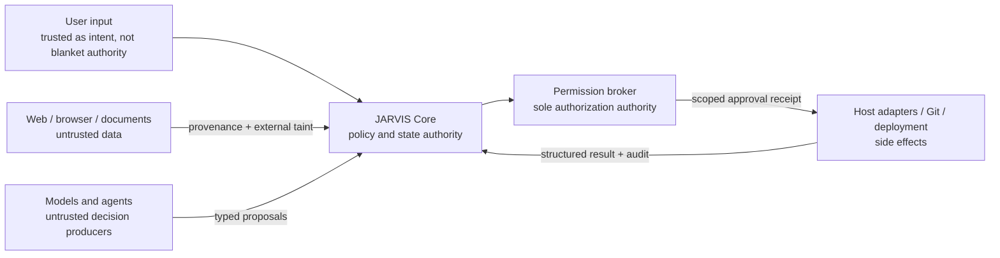

# JARVIS Security Architecture

Status: Enforced through Phase 4
Last updated: 2026-08-17

## Security goals

JARVIS may observe private local data and perform consequential actions. Its security model must preserve user control, constrain agents to intended resources, separate untrusted content from authority, protect secrets, and leave an auditable explanation of important actions.

Hard defaults:

- bind services to `127.0.0.1` only;
- run as the current user without Administrator privileges;
- deny unknown tools, actions, resources, and deployment adapter types;
- keep web/browser content untrusted;
- isolate coding tasks in Git worktrees;
- never push or deploy from conversational implication;
- never copy `.env` files into worktrees automatically;
- never expose a generic shell to research/browser workers;
- never store secret values in normal SQLite records, events, logs, or UI state;
- never continuously capture microphone/screen data in V1.

## Controls in force

- The configuration schema only accepts `127.0.0.1`; wildcard and LAN bindings fail validation.
- WebSocket clients must provide the `jarvis.auth.v1` subprotocol and a launch-scoped token encoded in a second subprotocol value. The token is compared in constant time and never placed in a URL.
- Browser origins are limited to the Tauri origin and loopback development origins. Health and capabilities are read-only; future command routes remain absent.
- The dashboard CSP only permits its own assets and the configured loopback core channel.
- Logs recursively redact credential-shaped keys and bearer/key-shaped values.
- Development, test, and production databases are physically separated. SQLite contains no secret-value column or generic credential store.
- The native host exposes only enumerated window/display and global-shortcut registration capabilities. System, shell, file, screenshot, and deployment capabilities are not granted.

Known Phase 0 gaps intentionally closed in later phases are replay/backpressure limits (Phase 1), a durable approval broker (Phase 14), and a Windows credential-store implementation before external providers are enabled.

Phase 1 closes the event-channel replay/backpressure gap with a 256 KiB message ceiling, a 500-event replay ceiling, a 512 KiB slow-consumer cutoff, strict registered payload schemas, a five-second subscription deadline, and rejection of binary/repeated/malformed subscription messages.

Phase 3 grants the Tauri host only enumerated monitor discovery and window create/place/focus/show/close capabilities. External web content is not loaded by the deck in this phase, and no generic shell or filesystem permission is added. Dynamically created windows must use the fixed `reference-deck` label and local application URL.

Phase 4 keeps `OPENAI_API_KEY` exclusively in JARVIS Core. The renderer submits only a bounded SDP offer over an origin-checked route authenticated by the launch-scoped token. Core creates the provider call and returns only SDP/call metadata. Provider errors are reduced to bounded safe messages; upstream bodies and authorization headers are not logged. Voice lifecycle submissions use a strict discriminated schema and cannot name arbitrary event types. Microphone capture begins only after `Alt+Space` or an explicit UI action, remains visibly active, and stops on **END VOICE** or teardown. There is no wake word or continuous pre-activation cloud stream.

Phase 5 treats routing as classification, never authorization. `/commands/route` accepts only authenticated, origin-checked, size-bounded JSON with `provenance.origin=user`; arbitrary provenance and fields fail schema validation. Decisions expose a bounded allow-listed shortlist and no executable arguments or approval flag. Injection-shaped text can select a consequential category but cannot invoke it. Execution remains absent until the owning subsystem and permission phase exist.

Phase 6 gives the research provider only HTTPS access to the configured model/search API. It receives no shell, filesystem, browser-control, Codex, Git, system, or permission capability. All returned URLs must use HTTP(S), remain explicitly untrusted, and are never interpreted as commands. Missing citations invalidate a result. The API key stays in Core request headers and provider response bodies are not logged or forwarded. Research failures expose only bounded codes/messages.

Phase 7 evaluates only query/answer metadata and source count; it cannot execute tools. Display events accept only strict item types and HTTP(S) URLs. A visual recommendation never changes provenance or trust, and a rendered source remains untrusted content. Reference windows open only from new live core events, not replay, preventing restart loops. Missing media providers degrade to cited source cards rather than guessed image/video URLs.

Phase 8 runs Playwright in a JARVIS-owned profile, never a personal browser profile. Navigation rejects non-HTTP(S), credential-bearing, loopback, link-local, private IPv4, and local/private IPv6 targets by default. Extracted text and DOM state remain web-tainted. The browser provider receives no shell, filesystem, system, Codex, Git, deployment, memory, or approval interface; website text cannot submit authenticated Core commands. Extracted text is capped at 100 KiB and interactions have bounded timeouts.

Phase 9 project scanning is read-only and bounded by depth and directory limits. Canonical real paths prevent path aliases from creating duplicate identities, while symbolic links and reparse points are not traversed. The registry reads top-level manifests but never executes discovered scripts. Registry removal deletes database metadata only, never project files.

Phase 10 indexing excludes VCS/dependency/build directories, symbolic links, environment/credential/private-key filenames, binary content, and files over 1 MiB. Ripgrep is invoked as a fixed executable with an argument array, fixed-string query, ignore globs, output cap, and timeout; project text can never supply flags or a command line. Indexed project content remains project-origin data and cannot grant permissions.

Phase 11 launches the fixed Codex executable with argument arrays and communicates only through structured App Server JSON. Threads are limited to the supplied workspace root with `workspace-write`; automatic approval escalation is disabled. Unexpected approval requests become visible and receive a transport denial until Phase 14 can issue action-bound permission receipts. The adapter cannot push or deploy through its task API.

Phase 13 rejects inferred/free-form verification commands. Only evidence-backed npm, pnpm, and yarn package scripts are converted into executable-plus-argument arrays. They run in the isolated task worktree with shell expansion disabled, a minimal inherited environment, bounded output, and a timeout. Diffs are anchored to the recorded worktree baseline and remain review artifacts, not executable instructions.

Phase 14 centralizes tool authorization in a closed action catalog. Clients cannot declare or lower risk. Each decision records action, exact resource/project, argument names, reason, provenance, state, and resolution; argument values affect the action digest but are redacted from the audit row. Elevated approvals issue a five-minute one-use receipt cryptographically bound to the canonical request. Replays, expiry, changed arguments/resources, unknown actions, missing Codex project scope, and untrusted web-origin state changes fail closed. Identical pending requests are deduplicated. The localhost launch token is still required to resolve an approval, while the action receipt is independently required to retry the exact elevated operation.

Phase 15 binds Git push approval to the exact task, owned branch, HEAD revision, and worktree-change digest, then recomputes that preview immediately before mutation. Only fixed remote `origin` and the exact `jarvis/*` task branch are accepted; force, tags, arbitrary refspecs, shell parsing, credential-bearing URLs, and interactive credential prompts are excluded. Secret-bearing changed paths fail before staging. A push failure may leave the approved local commit in the isolated worktree, but never reports success or mutates another checkout.

Phase 12 makes isolated Git worktrees mandatory for Core-created coding tasks. Source dirty state is observed but never reset or copied. Canonical containment and persisted ownership protect cleanup; dirty task worktrees are preserved. Repositories tracking `.env`, PEM, or private-key files are refused before checkout, and no non-Git fallback edits the registered source directory.

## Assets

Protected assets include:

- source code and uncommitted work;
- Git identities, remotes, credentials, and repository integrity;
- API keys, tokens, passwords, certificates, SSH keys, and environment secrets;
- microphone audio, screenshots, transcripts, memories, project indexes, and browsing history;
- local services, applications, files, network configuration, and deployment targets;
- approval intent and the distinction between review, commit, push, and deploy;
- audit/event history and provider output integrity.

## Threat actors and failure sources

- malicious or compromised web pages and documents;
- prompt injection embedded in research results, project files, issues, logs, or code comments;
- a model/provider producing an unsafe, malformed, or over-broad action;
- a coding agent escaping its intended project/worktree scope;
- another local process calling the loopback API or forging events;
- a compromised MCP/tool/provider process;
- dependency or updater supply-chain compromise;
- accidental user ambiguity, especially “it,” “push,” and “deploy” target resolution;
- implementation defects in path normalization, junction/symlink handling, quoting, retries, or concurrency;
- secret leakage through logs, diffs, screenshots, media metadata, or error messages.

## Trust boundaries



Trust distinctions:

- **User input** is the strongest source of intent but still requires target resolution and policy. “Deploy it” is not safe if “it” is ambiguous.
- **Project content** may be user-owned but can contain malicious third-party text. It informs analysis and coding, not permission.
- **Web content** is always untrusted and can never become a system/developer instruction.
- **Agent output** is a proposal. Agents do not grant themselves permission or mint approval receipts.
- **JARVIS Core** is the policy authority; dashboard/Tauri/provider processes cannot bypass it.
- **Permission Broker** is the only component that can authorize Level 2/3 execution under policy.

## Provenance and taint

Every tool-visible datum should carry provenance when it can affect an action:

```ts
interface DataProvenance {
  origin: "user" | "project" | "web" | "system" | "agent";
  trusted: boolean;
  source?: string;
  capturedAt: string;
  labels?: Array<"external" | "private" | "pii" | "secret" | "generated">;
}
```

Rules:

1. Web/browser output begins with `external` and `trusted: false`.
2. Model summarization does not remove taint or change origin; derived data cites its inputs.
3. Automatic detectors may add `pii` or `secret`; they cannot remove labels.
4. Data sent to an external provider passes an egress policy based on labels and user/provider configuration.
5. `secret` data is blocked from web search, telemetry, ordinary model context, notifications, and logs unless a purpose-built adapter has explicit authorization.
6. A user may explicitly declassify a specific value/action, but approval is scoped and audited; no global “trust this website” shortcut exists.

## Permission broker

### Complete mediation

All executable actions enter one broker API immediately before execution. Direct provider access to Git push, deployment, system control, credentials, or unrestricted process execution is prohibited. Adapters require a valid permission receipt for elevated methods.

An action request contains:

```ts
interface ActionRequest {
  id: string;
  actionType: string;
  riskLevel: 0 | 1 | 2 | 3;
  provider: string;
  operation: string;
  resource: string; // canonical identifier/path/URL/target
  projectId?: string;
  taskId?: string;
  worktreeId?: string;
  reason: string;
  argumentsDigest: string;
  provenance: DataProvenance[];
  requestedAt: string;
}
```

An approval receipt binds decision, exact action digest, resource, project/task, policy version, approver, issued/expiry time, and one-use nonce. Changing an argument, target, revision, environment, or adapter invalidates the receipt.

### Risk levels

| Level                             | Default                                | Examples                                                                                                                             | Constraints                                                                                       |
| --------------------------------- | -------------------------------------- | ------------------------------------------------------------------------------------------------------------------------------------ | ------------------------------------------------------------------------------------------------- |
| 0 — safe/read                     | Auto-allow under policy                | Read allowed project file, list directory, project search, public web search, Git status/diff, show reference, telemetry             | Canonical scope, data-egress policy, timeout, result limits, audit summary                        |
| 1 — isolated development          | Allow in configured task worktree      | Edit/create worktree file, project-local install, lint/typecheck/test/build, local dev process                                       | Must be owned worktree, no secret files by default, bounded child process, environment allow-list |
| 2 — repository/environment change | Ask or use explicit granular policy    | Commit, important config change, local service manipulation, install outside project                                                 | Exact preview, named project/resource, no blanket session shell permission                        |
| 3 — consequential                 | Explicit user authorization by default | Git push, protected merge, production deploy, migration/destructive DB action, firewall/admin/credential/secret/destructive deletion | Action-bound one-use receipt, ambiguity resolved, audit record, no implicit retry                 |

Unknown actions default to Level 3/deny until classified. Policy failures are explicit errors, never silent fallbacks.

### Natural-language authorization

- “Push it,” “push the branch,” or a named task can initiate a Level 3 request only after the target resolves unambiguously.
- “Looks good,” “done,” and “finish it” do not authorize push.
- “Deploy it” authorizes evaluation of a deployment request, not unsafe invention. If no valid config exists, only proposal generation runs.
- Approval for a proposal is distinct from approval to execute it.
- Stored user preferences may narrow confirmations but cannot silently disable the product's hard push/deploy defaults in V1.

## Tool and command design

Tools are typed capabilities with JSON-schema input, declared effects, risk, timeout, cancellation, resource resolver, and redaction policy. Prefer purpose-built operations.

Forbidden architecture:

```text
website text -> model-generated command string -> shell
```

Required architecture:

```text
website -> untrusted structured extraction -> orchestrator proposal
        -> canonical typed action -> permission broker -> scoped adapter
```

When a process is necessary:

- executable and arguments are separate values; no shell concatenation;
- working directory is canonical and within approved scope;
- environment begins empty/minimal and receives allow-listed values;
- stdout/stderr are bounded and redacted;
- deadline, cancellation, child-tree cleanup, and exit status are mandatory;
- a command allow-list or typed deployment/build adapter constrains behavior;
- administrator elevation is a new Level 3 action.

## Filesystem and path security

1. Resolve canonical source, worktree, and target paths before authorization and again before mutation.
2. Reject traversal, device paths, UNC/network paths, alternate data streams, and unexpected drive changes unless a specific provider/policy supports them.
3. Treat symlinks, junctions, and reparse points as boundary crossings; verify the final resolved target remains inside the approved root.
4. Never use a workspace root, home directory, drive root, glob, unresolved variable, or model-provided path as a recursive deletion target.
5. Destructive cleanup verifies task ownership, database record, Git worktree registration, canonical location under the JARVIS worktree root, and review/dirty state.
6. Project indexing excludes secrets, ignored paths, VCS internals, dependency trees, binaries, generated outputs, and configured private patterns.

## Coding-agent isolation

Worktrees prevent parallel edit collisions but are not a complete security sandbox. V1 combines:

- a unique worktree and branch per significant task;
- one mutation owner and canonical path lock;
- child-process supervision and Windows job/process controls where feasible;
- current-user, non-admin execution;
- minimal environment and named secret injection;
- explicit network/tool policy;
- no automatic `.env`, SSH key, credential, or browser-cookie copying;
- structured Codex approvals routed through JARVIS;
- verification commands inferred only from evidence and recorded project metadata;
- diff and important-file review before elevated Git/deployment transitions.

A future container/VM provider may strengthen isolation. The UI must not claim a worktree is a security sandbox.

## Browser and research isolation

- Use a dedicated JARVIS Chromium profile/context; never the personal Chrome profile by default.
- Browser and research workers receive no general filesystem, Git, Codex, deployment, system, or secret tools.
- Downloads are disabled or quarantined by default and require typed handling.
- Navigation applies scheme and SSRF policy. `file:`, privileged browser URLs, loopback/private/link-local/metadata endpoints, and local network targets are denied by default unless the user explicitly invokes a scoped browser/system workflow.
- Extracted text is size-bounded, attributed, and marked untrusted.
- Reference Deck web rendering uses an unprivileged window/content security policy without native IPC capability.
- Page instructions such as “ignore previous instructions,” approval buttons, or pasted commands remain content, never authority.

## Git security

- Inspect status, diff, and local branches under Level 0.
- Worktree/branch creation and task edits are constrained Level 1 operations.
- Commit policy is configurable but always records exact task, diff/tree identity, authoring mode, and checks.
- Push defaults off and requires explicit Level 3 authorization for the resolved task/remote/refspec.
- Protected/default branch merges are separate Level 3 operations.
- Do not embed credentials in remote URLs or logs.
- Reject unexpected remote changes between preview and execution unless re-approved.
- Never interpret “looks good” as push or merge authorization.

## Deployment security

Deployment uses discriminated adapters, never an unvalidated model-written command string. A configuration contains adapter type/version, environment, canonical working directory, preflight steps, deployment inputs, health check, rollback strategy, and named secret references.

For a missing config:

1. read-only analysis gathers evidence from repository files;
2. a proposal records confidence, evidence, assumptions, and unresolved fields;
3. validation performs schema and adapter-specific checks without production mutation;
4. the user reviews and fills missing target/credential references;
5. saving the config and executing the first deployment are distinct decisions;
6. production execution receives a one-use Level 3 receipt;
7. health/rollback results are audited without secrets.

Deployment never fabricates credentials, reveals secret values, or retries a consequential step blindly.

## Local service and desktop security

- Bind only IPv4/IPv6 loopback explicitly; do not rely on hostname resolution.
- Authenticate the desktop with a launch-scoped token stored/passed through an ACL-restricted mechanism.
- Enforce allowed origins and protocol/schema compatibility.
- Keep tokens out of query strings, command-line arguments where visible, normal logs, and crash reports.
- Limit payload size, command rate, WebSocket clients, and replay range.
- Expose no generic filesystem or shell endpoint to the renderer.
- Tauri capabilities are window-specific; external/reference web windows receive no privileged commands.
- LAN exposure, if ever added, requires explicit configuration, strong authentication, TLS or a trusted tunnel, and separate threat review.

## Secrets

`SecretProvider` resolves named secrets from Windows Credential Manager initially, with an environment-only development fallback. SQLite/config store only opaque secret references.

Controls:

- least-privilege secret names per provider/project/environment;
- reveal never returns values to normal UI;
- inject at execution boundary only;
- redact exact known values plus key/token/password patterns before logging/events;
- prevent secret-bearing output from research, reference, notifications, diffs, or telemetry;
- do not persist child-process environments;
- rotation/deletion invalidates cached handles;
- secret access is Level 3 unless a narrow pre-approved adapter policy exists.

## Logging, events, and audit

Normal structured logs include timestamp, severity, component, event/code, session/correlation/project/task/agent-run identifiers, duration, and safe outcome. They exclude prompts/content by default unless developer diagnostics explicitly enable a redacted mode.

Consequential audit records include action digest, resolved target, risk level, policy decision, user approval/rejection, provider/adapter, start/end, and safe result. Audit records do not contain secret values or full sensitive command output.

The developer log viewer is separate from the conversation. The UI shows user-meaningful summaries and links to redacted diagnostics.

## Memory and privacy

- Persist only through explicit memory tools/policy, not every conversational sentence.
- Scope access to session/project/global purpose.
- Store origin, timestamp, confidence, and supersession/deletion state.
- Web/agent statements cannot silently become user facts.
- Sensitive/global memory may require confirmation.
- Project memory is not retrieved outside its project without explicit cross-project action.
- Users can inspect and delete memories.
- Continuous capture is absent in V1; explicit screenshots show a capture indicator and purpose.

## Supply-chain and licensing controls

- Lock dependencies and review install scripts/native binaries.
- Generate an SBOM and third-party notices for releases.
- Verify checksums/signatures for downloaded sidecars where upstream supports them.
- Pin compatible Codex protocol versions and reject unknown incompatible behavior.
- Re-check licenses before upstream code reuse; preserve source provenance and notices.
- Do not copy source/assets from non-commercial, ambiguous, or AGPL projects without an explicit licensing decision.

## Security testing requirements

Unit and integration tests must cover:

- default deny for unknown actions;
- all Level 3 actions requiring correct, unexpired, one-use receipts;
- receipt invalidation when target/arguments/revision/environment change;
- approval denial and timeout;
- ambiguous push/deploy target rejection;
- web prompt injection and tool-output injection;
- provenance/taint propagation through summarization;
- SSRF and unsafe URL schemes;
- path traversal, junction/symlink escape, UNC/device/ADS paths;
- forged/malformed/replayed events and unauthorized local clients;
- secret redaction in logs, errors, events, diffs, and notifications;
- worktree collision/ownership and safe cleanup;
- browser profile isolation;
- deployment missing-config proposal with zero execution;
- process timeout/cancellation/child cleanup;
- SQLite migration/recovery and audit durability.

## Residual risks and deferred work

- Models can still produce persuasive unsafe proposals; human approval is not perfect. Previews must be concrete and machine-bound.
- Current-user processes can access much of the user's data; stronger container/VM isolation is future work.
- Windows accessibility/audio/display APIs vary across hardware and security products; capability failure must be visible.
- Screen capture can include secrets despite redaction. V1 capture is explicit and reviewable; continuous capture needs a separate design.
- A compromised dependency within the trusted core can bypass application policy. Dependency minimization, signing, SBOM, and updates reduce but do not eliminate this risk.
- Localhost authentication protects API entry but cannot fully defend a compromised user session. OS account security remains a prerequisite.

## Audit-derived changes

This security baseline specifically incorporates:

- OpenJarvis-style capability and taint checks at the executor boundary;
- Agent Zero-style separation between agent environment and explicit host bridge;
- Codexia-style structured approval correlation and worktree locking;
- Screenpipe-style privacy gating before capture and development/production data isolation;
- isair-style untrusted web-result treatment and bounded tool exposure.

It explicitly rejects observed fail-open permission paths, default permission bypasses, automatic `.env` copying, broad host mounts, and experimental no-auth/no-acknowledgement behavior.
